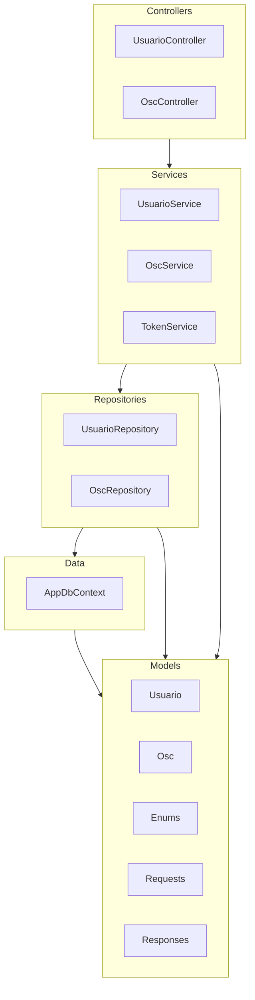

    

    <b>Automatic Architecture Diagrams from Code</b> 
    <a href="https://github.com/swark-io/swark">GitHub</a> • <a href="https://swark.io">Website</a> • <a href="mailto:contact@swark.io">Contact Us</a>

## Usage Instructions

1. **Render the Diagram**: Use the links below to open it in Mermaid Live Editor, or install the [Mermaid Support](https://marketplace.visualstudio.com/items?itemName=bierner.markdown-mermaid) extension.
2. **Recommended Model**: If available for you, use `claude-3.5-sonnet` [language model](vscode://settings/swark.languageModel). It can process more files and generates better diagrams.
3. **Iterate for Best Results**: Language models are non-deterministic. Generate the diagram multiple times and choose the best result.

## Generated Content
**Model**: GPT-4o - [Change Model](vscode://settings/swark.languageModel)  
**Mermaid Live Editor**: [View](https://mermaid.live/view#pako:eNp1UstuwyAQ_BVrz8kP-FCpqnusKiXpjQsxmxiVV3hUjaL8e7FTFzDuntiZ3Rl24Qa9ZggtEHW21AzNoSOqieHC8QG8aOWtFgKtezBjfLhALdeJS9S765cwKkbUQnaP9ov3WGv-EoVghR30J6oCXfPYodGOe235is8feS2slvCabkc9TU3PxnTHcWT89v_3vMU1i_oWhXdKXlWQWfEOLwGdLxBntHLzXJlj9l7Ndvu0WPScTVS9nxyZStKo42mC8kkKuZyohGYSNiDRSspZ_HQ3An5AiQTahgDDEw3CE7jHomAY9dhxGtcnofU24AZo8Hp_Vf2cWx3OA7QnKhzefwBXwuQA) | [Edit](https://mermaid.live/edit#pako:eNp1UstuwyAQ_BVrz8kP-FCpqnusKiXpjQsxmxiVV3hUjaL8e7FTFzDuntiZ3Rl24Qa9ZggtEHW21AzNoSOqieHC8QG8aOWtFgKtezBjfLhALdeJS9S765cwKkbUQnaP9ov3WGv-EoVghR30J6oCXfPYodGOe235is8feS2slvCabkc9TU3PxnTHcWT89v_3vMU1i_oWhXdKXlWQWfEOLwGdLxBntHLzXJlj9l7Ndvu0WPScTVS9nxyZStKo42mC8kkKuZyohGYSNiDRSspZ_HQ3An5AiQTahgDDEw3CE7jHomAY9dhxGtcnofU24AZo8Hp_Vf2cWx3OA7QnKhzefwBXwuQA)

